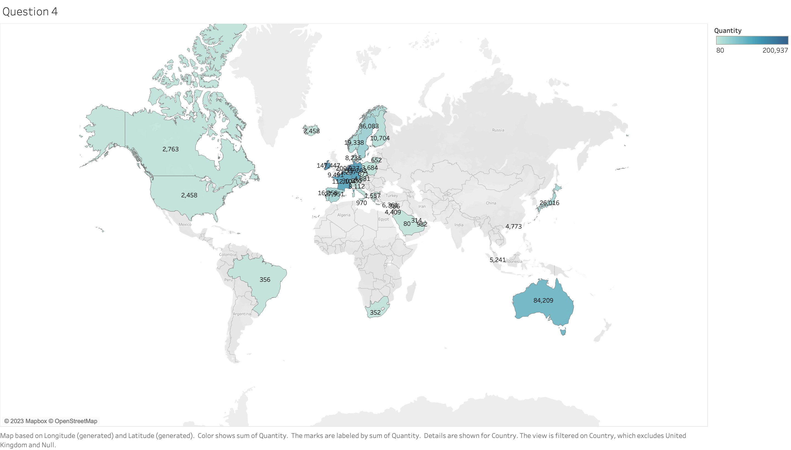

# Tata Insights and Quants Data Visualization Virtual Job Simulation

This GitHub repository documents my progress and shares insights from the "Data Visualisation: Empowering Business with Effective Insights" Virtual Experience Programme. This programme is offered by Tata Insights and Quants (Tata iQ) through Forage.

## Table of Contents

1. [Programme Duration and Role](#programme-duration-and-role)
2. [Tasks Overview](#tasks-overview)
   - [Task 1: Framing the Business Scenario](#task-1-framing-the-business-scenario)
   - [Task 2: Choosing the Right Visuals](#task-2-choosing-the-right-visuals)
   - [Task 3: Creating Effective Visuals](#task-3-creating-effective-visuals)
   - [Task 4: Creating a Dashboard](#task-4-creating-a-dashboard)
3. [Certificate of Completion](#certificate-of-completion)

## Programme Duration and Role

Over the course of `one week`, I played the role of a `Data Visualization Analyst` at Tata iQ. This programme provided me with the opportunity to address the needs of various stakeholders, interact with end-users, understand their objectives, and create dashboards or visualizations to help them derive valuable insights from their data.

## Tasks Overview

### Task 1: Framing the Business Scenario

**Objective:** Prepare Questions for CEO and CMO Meeting

In this task, I anticipated and prepared insightful questions from the perspectives of the CEO and CMO, based on a given dataset, to facilitate strategic business discussions in an upcoming meeting.

**What I learned in this task:**
- Enhanced my critical thinking and data interpretation skills
- Developed business acumen and communication skills
- Gained specific insights into the business operations of Tata iQ and the retail industry.

### Task 2: Choosing the Right Visuals

**Objective:** Choosing the right visual representations of key business metrics, as requested by the CEO, to facilitate effective decision-making and strategic planning in the online retail company.

ps. There was no deliverable for this task, only a set of questions and quizzes to guide my thought process.

**What I learned in this task:**
- Understanding the `Grammar of Graphics` for Effective Data Visualization
- The concept of `Datasauras Dozen` and `Anscombe's quartet` and why it is important to always visualize data.
- Examined Global CO2 Emissions Patterns using Data Visualization Techniques with Plotnine and the Grammar of Graphics Framework `(I undertook this project as a side project to strengthen my concepts, and it can be found in the repository under Task_2 and was not required for the completion of the programme)`
- How to choose the right chart for Data Visualization

### Task 3: Creating Effective Visuals

**Objective:** Create informative and actionable visuals using `Tableau` to aid in executive decision-making, focusing on revenue trends, country-specific revenues, customer segmentation, and product demand

I used the `Online Retail Data Set.xlsx` to complete this task. All these visualizations are available in the repository under Task_3 in the form of a Tableau Workbook `(MyWorkbook.twbx)`

**What I learned in this task:**
- Navigating and Using the `Tableau interface`
- `Data cleaning and preparation` using Tableau, by implementing `filters` at the data source level for consistency across all visualizations.
- Manipulating Time-series data using Tableau
- Creating calculated fields and parameters in Tableau
- Interpreting line charts and recognizing trends in data

*Below is the time series visual of the 2011 revenue data showing each month `(Question 1)`:*

- Creating and customizing side-by-side bar charts in Tableau
- Implementing advanced filters like filtering the top 10 items in a category and excluding specific items from a visualization.

*Below is the side-by-side bar chart of the top 10 countries generating the highest revenue, excluding the UK `(Question 2)`:*

- Filtering Data by removing `null values` and applying a `Top N` filter to the data
- Sorting data and creating bar charts

*Below is the bar chart of the top 10 customers generating the highest revenue in descending order `(Question 3)`:*

- How to create a filled map visualization in Tableau
- Applying filters to exclude specific data and adding and customizing labels in Tableau

*Below is the map chart that highlights each country and shows the total number of units sold by country `(Question 4)`*

### Task 4: Communicating Insights and Analysis

**Objective:** Effectively communicate the results of a data analysis, including data cleanup, visualization, and key insights, to the CEO and CMO, focusing on business expansion opportunities, through a clear and concise video presentation.

**What I learned in this task:**
- How to communicate data analyses in a simple and understandable way
- How to use Tableau's Story feature to create a sequence of visualizations that work together to convey a message and make the presenation more interactive.
- Presentation Skills.

*Below is the link to the video presentation for Task 4:*

[Link](https://drive.google.com/drive/folders/17oCTj65-EEodEbGDBSU4SCevyYGYAsn5?usp=drive_link)

## Certificate of Completion

